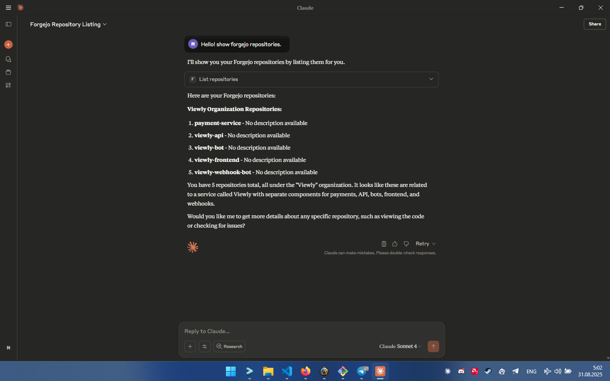

# Forgejo MCP Server

A Model Context Protocol (MCP) server that provides Claude Desktop with tools to interact with Forgejo repositories.



## Features

- List repositories
- Get repository information
- List issues with filtering by state
- Create new issues
- Read file contents from repositories

## Installation

```bash
git clone https://github.com/nsvk13/forgejo-mcp-server
cd forgejo-mcp-server
bun install
bun run build
```

## Configuration

### Environment Variables

Set the following environment variables:

- `FORGEJO_BASE_URL`: Your Forgejo instance URL (e.g., `https://your-forgejo.com`)
- `FORGEJO_TOKEN`: Your Forgejo API token

### Generating a Forgejo API Token

1. Go to your Forgejo instance
2. Navigate to Settings → Applications
3. Generate a new token with appropriate permissions
4. Copy the token for use in configuration

### Claude Desktop Configuration

Add the following to your Claude Desktop configuration file:

**Windows**: `%APPDATA%\Claude\claude_desktop_config.json`
**macOS**: `~/Library/Application Support/Claude/claude_desktop_config.json`

```json
{
  "mcpServers": {
    "forgejo": {
      "command": "node",
      "args": ["/absolute/path/to/forgejo-mcp-server/dist/index.js"],
      "env": {
        "FORGEJO_BASE_URL": "https://your-forgejo-instance.com",
        "FORGEJO_TOKEN": "your_api_token_here"
      }
    }
  }
}
```

Replace the path and credentials with your actual values.

## Usage

After configuration, restart Claude Desktop. You can then use commands like:

- "List my Forgejo repositories"
- "Show issues in repository owner/repo-name"
- "Create an issue in repository with title 'Bug report'"
- "Show the contents of README.md from repository"

## Available Tools

- `list_repositories`: Get list of user repositories
- `get_repository`: Get detailed repository information
- `list_issues`: List issues with optional state filtering
- `create_issue`: Create a new issue
- `get_file_content`: Read file contents from repository

## Development

```bash
# Build the project
bun run build

# Run in development mode
bun run dev
```

## Requirements

- Bun 1 or higher
- TypeScript
- Valid Forgejo instance with API access